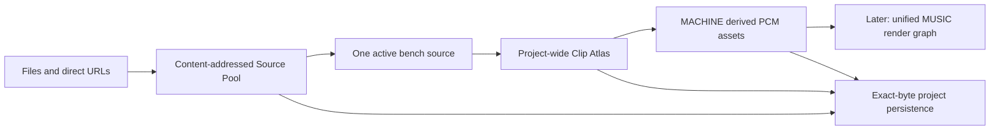

# Yellowjacket Phase 1: Multi-source Foundation

**Status:** Approved direction; implementation pending

**Date:** 2026-08-30

**Decision:** Build the Source Pool and Clip Atlas before a unified arranger or new DSP

## 1. Product decision

Yellowjacket's next product is a **provenance-first, multi-source sampling
workstation backed by a benchmark-first adaptive DSP core**.

This phase does not attempt to become a full browser DAW. It establishes the
smallest durable architecture that lets a musician:

1. add several recordings without replacing earlier recordings;
2. inspect, annotate, repair, and clip each recording independently;
3. find and audition clips across the whole project;
4. assign clips from different sources to one MACHINE kit without losing their
   source history;
5. close, resume, export, and re-import the project without losing bytes or
   provenance.

The creative proof is deliberately concrete: import real nature audio and other
lawfully controlled material, carve useful elements from several sources, put
those elements on MACHINE tracks, and play them together. A unified MUSIC
timeline and bounce come after this foundation can preserve and resolve every
source reliably.

## 2. Why this slice comes first

The current application has one project-wide source working set:
`fileName`, `words`, `transcript`, `chain`, `clips`, and the runtime
`buffer`/`mono`/`sourceBytes` fields. Loading another audio file intentionally
replaces that working set. Portable projects likewise contain at most one
`source.bin`.

MACHINE is already different: it can hold several copied PCM assets and play
them together. That means Yellowjacket can make a multi-source kit today only
through a destructive sequence that forgets the earlier source, its clips, and
its bench state. Building an arranger on that model would hard-code data loss
into every later feature.

The chosen sequence is therefore:



### Alternatives rejected for this phase

- **Keep replacing the singular source and add more UI around it.** This cannot
  preserve per-source edits or trace a mixed kit back to its inputs.
- **Build the full timeline immediately.** This would couple arrangement,
  source lifecycle, persistence, render semantics, and DSP before the source
  identity model is trustworthy.
- **Treat imported clips as anonymous copied PCM.** That makes playback easy
  but destroys traceability, rights notes, and the ability to reopen the exact
  source span.

## 3. Scope

### In scope

- An audio-only multi-file picker and multi-file drag/drop path.
- Repeated or batched direct-audio URL import where CORS permits it.
- Content-addressed source identity and exact encoded-byte retention.
- A Source Pool that adds, selects, renames, annotates, and safely removes
  sources.
- Per-source transcript, gap-cut, rack, repair, and beat-anchor documents.
- A project-wide Clip Atlas whose clips identify their source.
- Cross-source clip assignment to MACHINE with durable provenance.
- Project format version 3, including migration from source-backed and
  source-free version 2 projects.
- OPFS autosave and portable `.yjkt` round trips for multiple sources.
- Transactional import, activation, restore, and removal behavior.
- Fidelity, integrity, memory, and stale-job acceptance tests.

### Explicitly out of scope

- A linear arranger or unified MACHINE + STUDIO + audio-clip bounce.
- YouTube-specific downloading, browser-tab capture, microphone capture, or
  system-audio recording.
- Video demuxing.
- Stem separation.
- New time-stretch, pitch-shift, restoration, mastering, or adaptive DSP.
- Key detection and harmonic-compatibility recommendations.
- New factory drum kits or sample packs.
- Automated copyright clearance or a claim that a rights note is legal advice.
- Project merging or importing sources from one `.yjkt` into another.

These exclusions are sequencing decisions, not a retreat from the larger
product. They keep Phase 1 independently useful and independently testable.

## 4. Invariants

The implementation must preserve these invariants across every code path:

1. **Identity is bytes, not a filename.** A source ID is
   `sha256:<64 lowercase hex characters>` computed from the exact encoded bytes.
2. **No implicit transcoding.** Imported source bytes are stored exactly as
   received. Decode retains the current native-rate behavior and does not create
   a project-wide sample rate.
3. **One source record, one payload.** Two imports with the same digest select
   the existing record and add an alias; they never duplicate audio storage.
4. **No destructive source switch.** Activating another source cannot clear
   clips, MACHINE assets, LOOM plans, or another source's bench document.
5. **A ClipRef always names a source.** `sourceId`, `start`, and `end` are the
   immutable source-span identity. Labels and classifications may change.
6. **Copied PCM keeps provenance.** Once a clip is assigned to MACHINE, its
   exact copied PCM remains authoritative for playback and its asset metadata
   retains the source, clip, extraction boundary, and applied transforms.
7. **Cold sources are encoded, not decoded.** Phase 1 permanently retains only
   the active decoded source. A target may be staged temporarily during an
   atomic switch, then the old decoded working set is released.
8. **A manifest commits last.** Source/sample payloads are written before the
   project document that references them. Cleanup happens only after that
   manifest write succeeds.
9. **Failure does not cross source boundaries.** A failed file in a batch does
   not roll back successful files, and a failed activation or project import
   does not replace the current working state.
10. **No unsupported quality or novelty claim.** A method becomes
    “higher-quality,” “adaptive,” or “novel” only after a versioned benchmark
    establishes the stated comparison.
11. **Project-local IDs never collide or recycle.** Clip and asset IDs come from
    persisted monotone allocators. Import rejects duplicate clip IDs and stale
    allocator state.
12. **Every current asset has bytes.** `project.assets` contains exactly the PCM
    assets reachable from current MACHINE tracks, and every one has one
    digest-verified payload. Metadata without recoverable PCM is invalid.

## 5. Project document: format version 3

Version 3 separates global music state from source-specific bench state.
Encoded source bytes and PCM samples remain outside JSON.

```js
{
  formatVersion: 3,
  savedAt: 1788134400000,
  activeSourceId: "sha256:<64 hex>", // null for a source-free project
  allocators: { clip: 1, asset: 1 }, // highest project-local IDs ever issued

  sources: {
    "sha256:<64 hex>": {
      id: "sha256:<64 hex>",
      displayName: "dawn-marsh.wav",
      aliases: ["dawn-marsh.wav"],
      addedAt: 1788134400000,

      origin: {
        kind: "file",                // file | url | demo | field | generated
        url: null                     // normalized http(s) URL or null
      },

      payload: {
        byteLength: 18432000,
        mediaType: "audio/wav",      // advisory, never trusted for identity
        extension: "wav"             // normalized advisory suffix or null
      },

      audio: {
        sampleRate: 96000,            // last successful local decode
        channelCount: 2,
        frames: 28800000
      },

      rights: {
        basis: "original-recording", // unknown | original-recording |
                                      // public-domain | licensed | permission |
                                      // fair-use-review
        license: null,
        attribution: null,
        notes: null
      },

      document: {
        words: null,
        transcript: { gapCuts: [] },
        chain: [{ id: "...", on: false, params: {} }],
        repairs: [],
        anchors: { bpm: null, barOneTime: null }
      }
    }
  },

  clips: [{
    id: "c1",
    sourceId: "sha256:<64 hex>",
    start: 12.125,                    // original decoded-source seconds
    end: 12.842,
    tag: "transient",
    label: "reed snap",
    createdAt: 1788134400000
  }],

  assets: {
    a1: {
      id: "a1",
      kind: "sample",
      label: "reed snap",
      role: "PERC",
      sampleRate: 96000,
      frames: 68832,
      channelCount: 2,
      payload: {
        byteLength: 550656,
        sha256: "sha256:<64 hex>"     // canonical channel-major f32 bytes
      },
      provenance: {
        kind: "source-clip",
        binding: "project",           // project | external
        sourceId: "sha256:<64 hex>",
        clipId: "c1",
        sourceSpan: { start: 12.125, end: 12.842 },
        extraction: {
          startFrame: 1164000,
          endFrame: 1232832,
          sampleRate: 96000,
          channelCount: 2,
          buffer: "original"         // original | repaired
        },
        transforms: []                // ordered, serialized transform records
      }
    }
  },

  machine: { /* existing v2 document */ },
  studio: { /* existing v2 document */ },
  loom: { /* existing v2 document */ },
  wire: { /* existing v2 document */ }
}
```

### Schema rules

- The key in `sources`, the record's `id`, and the digest of its payload must
  agree exactly.
- `activeSourceId === null` if and only if `sources` is empty. A non-null active
  ID must name a source record. Phase 1 has no ambiguous “pool exists but no
  source is active” state.
- The source payload entry is derived from the validated ID; no user-controlled
  path is stored in JSON.
- `audio` is descriptive decode metadata, not an integrity check. Encoded-byte
  identity remains portable even if codec priming produces a small duration
  difference between browser decoders. Clip bounds are checked against the
  actual decoded buffer on activation.
- Duration is derived from `frames / sampleRate`; it is not stored as another
  value that can drift.
- `displayName` is editable. `aliases` is deduplicated and bounded; it preserves
  alternate import names without changing identity.
- URL provenance is retained only for actual URL imports. File pickers expose a
  filename, not a local filesystem path, and Yellowjacket must not synthesize one.
- Rights fields are user assertions. Unknown is the safe default. Known demo or
  field-library metadata may prefill a basis and attribution only when the
  catalog explicitly provides them.
- Clip seconds remain the portable source coordinate used by Transcript,
  BEATMAP, and LOOM. Extraction converts them deterministically with
  `floor(start * sampleRate)` and `ceil(end * sampleRate)`, then clamps to the
  decoded buffer. The exact resulting frame range is recorded on the copied
  asset.
- A repaired extraction records `buffer: "repaired"` plus a serialized repair
  stack in `transforms`. HARVEST's leveling records its applied linear gain.
  Playback never depends on successfully replaying those transforms because the
  resulting PCM is persisted.
- New source-backed assets must carry provenance. `binding: "project"` means
  the source payload is part of this project and must resolve; `binding:
  "external"` preserves an identity copied from CRATE or another self-contained
  asset without pretending its source payload is present. Existing, generated,
  factory, and legacy assets may legitimately have no source provenance; the
  application must not invent it. LOOM plans retain their existing explicit
  online/offline semantics and may likewise describe a source outside the pool.
- `allocators.clip` and `allocators.asset` are non-negative safe integers holding
  the highest issued `cN` and `aN` suffixes. Allocation increments first and
  never reuses an ID, including after deletion. All ClipRef IDs are unique
  project-wide; source ID is not part of their lookup key.

### Asset ownership and PCM integrity

Phase 1 uses a reachability-owned asset model, not an unbounded hidden asset
library:

- `project.assets` contains exactly the asset IDs referenced by at least one
  current MACHINE scene track.
- Every asset has one immutable PCM payload. Reprocessing creates a new asset ID;
  an existing asset ID's bytes are never rewritten.
- The canonical payload is channel-major IEEE-754 binary32, little-endian. Its
  exact byte length and SHA-256 digest live in asset metadata and are checked
  before hydrate/use, portable import, and manifest commit.
- A runtime `assetPcm` map owns PCM independently of whichever track is active;
  compatibility `track.sample` references resolve from that map.
- Replacing or clearing the last current track reference removes the asset
  metadata in the same project update. The payload is garbage-collected only
  after a manifest without that asset commits.
- Undo/redo snapshots still omit PCM. A bounded history-retention map keeps the
  bytes for asset IDs reachable from undo/redo snapshots; applying a snapshot
  must resolve every restored asset from current or history PCM before it
  commits. When the relevant history entry is evicted or history is cleared,
  history-only PCM may be released. Undo history is session-local, so an asset
  absent from the committed manifest is not promised after reload.
- History-only PCM has a 256 MiB byte budget in addition to the existing
  60-snapshot count. The store evicts oldest snapshots and their newly
  unreachable PCM together until both bounds hold, and reports `UNDO HISTORY
  TRIMMED TO PROTECT AUDIO MEMORY`. It never drops bytes while leaving a history
  entry that claims they can be restored.
- Portable export contains one `samples/<assetId>.f32` for every current asset,
  neither fewer nor more. Import requires exact equality among current track
  references, `project.assets` keys, and sample payload IDs.

### Canonical validation bounds

The version 3 trust boundary uses shared constants in pure code; UI validation
and import preflight call the same functions.

- `project.json` is at most 16 MiB before JSON parse; a project has at most 256
  sources, 65,536 clips, 16 aliases per source, and 1,024 ZIP entries under the
  existing 768 MiB expanded limit.
- Display names and aliases are trimmed, non-empty, at most 255 Unicode code
  points and 1,024 UTF-8 bytes. Alias insertion order is stable; a local add at
  the limit keeps the existing 16, while an imported over-limit array is invalid.
- HTTP(S) origin URLs are at most 4,096 UTF-8 bytes, contain no username or
  password, discard fragments, retain path/query, and serialize through
  `new URL(...).href`. Other protocols are invalid.
- `mediaType` is null or a lowercased ASCII MIME token no longer than 127 bytes.
  `extension` is null or 1–16 lowercase ASCII letters/digits.
- Timestamps are null or integer epoch milliseconds in JavaScript's valid Date
  range. A migrated ClipRef uses `createdAt: null` rather than a fabricated
  creation time.
- Byte lengths, frames, channel counts, allocators, and sample rates are finite
  safe integers; validation must not use 32-bit coercions. Times are finite,
  non-negative, and each clip has `end > start`. Canonical PCM contains only
  finite Float32 values; NaN and infinities are invalid.
- Rights basis is exactly one declared enum value. License and attribution are
  null or at most 2,048 UTF-8 bytes; notes are null or at most 8,192 bytes.
- A transform is `{ schemaVersion, kind, ...params }`. At most 32 transforms and
  64 KiB of serialized transform data may attach to one asset. Phase 1 executes
  no provenance transform. It validates `spectral-repair-stack` version 1 with
  the existing repair schema and `linear-gain` version 1 with a positive finite
  gain no greater than 64. An unknown bounded descriptor is preserved with
  `replayable: false`; the persisted PCM remains authoritative.
- Analysis/cache version IDs match `[a-z0-9][a-z0-9._-]{0,63}`. An unknown
  analysis version invalidates the cache, never the source or project.

## 6. Runtime architecture

### 6.1 Source registry

A new pure module, `js/app/source-registry.js`, owns validation and operations on
the JSON-safe registry:

```js
createSourceRecord(input)
addSource(project, record)             // add or deterministic dedupe result
addSourceAlias(project, sourceId, name)
sourceReferences(project, sourceId)    // clips, assets, LOOM plans
removeSource(project, sourceId)        // refuses referenced sources
validateSourceRecord(record)
sourceEntryName(sourceId)              // sources/<64hex>.bin
```

The registry owns no DOM, Web Audio object, or storage handle. Its return values
distinguish `added`, `duplicate`, `blocked`, and `invalid`; UI copy must not infer
those states from thrown strings.

### 6.2 Source payload store

`js/app/source-payload-store.js` provides one interface over durable OPFS and an
ephemeral in-memory fallback:

```js
put(sourceId, bytes)       // immutable write; verifies an existing entry
get(sourceId)
has(sourceId)
remove(sourceId)
listIds()
```

OPFS uses `sources/<digest>.bin` inside the existing Yellowjacket project
directory. The path contains only a validated lowercase SHA-256 digest. Writes
are content-addressed and idempotent. A same-name entry with the wrong length or
digest is corruption, not a cache hit.

When OPFS is unavailable, the memory implementation keeps the exact payload for
the current tab and the Source Pool marks the project **SESSION ONLY**. It does
not pretend that resume is available. Portable export remains available while
the tab still owns every payload.

### 6.3 Active-source session

`js/app/source-session.js` owns the only mutable decoded source working set. It
coordinates the source registry, payload store, playback engine, analysis
worker, bench UI, and autosave.

The global `project.machine`, `project.studio`, `project.loom`, `project.wire`,
`project.assets`, and `project.clips` remain live objects. The legacy
source-facing fields (`fileName`, `words`, `transcript`, and `chain`) and runtime
fields (`buffer`, `mono`, `sampleRate`, `repairs`, `analysis`, `peaks`,
`renderedBuffer`, and `original`) become an **active-source working facade**.
They are not serialized as a second top-level copy in version 3.

The active source's working facade is authoritative while that source is open.
Before a switch, save, export, or undo snapshot, the session produces a
JSON-safe projection into that source's `document`. Inactive source documents
are already self-contained. Hydration mutates controller-held arrays and rack
objects in place where current controllers require stable references.

This facade is an explicit migration boundary. New source-aware code receives a
`sourceId` or calls `activeSourceId()`; it may not reach into a second implicit
“current source” model. Once all source-facing controllers use the session API,
the compatibility fields can disappear without changing format version 3.

### 6.4 Decode/install split

`js/audio-engine.js` must split the current mutating `load()` operation:

```js
decode(arrayBuffer) -> { buffer, mono, decodeReport }
install(decodedSource)
```

`decode()` may create the existing native-rate `OfflineAudioContext`, but it
must not stop playback or change the installed source. `install()` is the short,
synchronous commit point and must not throw for a validated decoded object. This
makes source activation and project restore transactional instead of clearing a
good bench before a new file proves it can decode.

Every operation that changes the active source—new import, ordinary activation,
active-source removal, resume, and portable project import—uses one prepared
commit protocol:

1. `prepareActivation()` reads/hashes/decodes the payload, normalizes the target
   source document into detached facade data, builds required derived view data,
   validates controller binding contracts, and captures a restorable checkpoint
   of the prior active ID, facade, and installed engine object. It mutates no
   live project, engine, or DOM state.
2. `commitActivation()` installs only prepared objects, mutates compatibility
   arrays/objects through tested no-throw replacement helpers, updates the live
   registry when needed, and sets `activeSourceId` last. It emits one
   `sourceactivated` event only after every model/runtime invariant holds.
3. Autosave/project-manifest work is scheduled only after that event. A failed
   active-source commit can never write a manifest naming the failed target.
4. An unexpected commit exception restores the captured checkpoint
   synchronously, suppresses the activation event, retains the prior manifest,
   and leaves any newly written content-addressed payload as harmless orphan
   garbage. Required view listeners are error-isolated; a rendering fault is
   reported and retried from the coherent committed state rather than being
   allowed to partially mutate audio/project state.

If the later manifest write fails after a successful live commit, the live state
remains coherent but visibly `UNSAVED`; the prior manifest and all possibly
needed payloads remain intact, and the single-flight queue retries. Payload
garbage collection is never part of the live commit.

Controller listeners are registered at application initialization, not during
source activation. The same functions implement the active-source step of
version 2 migration and version 3 portable import; those paths do not get a
second, weaker transaction.

### 6.5 Decoded-memory policy

Phase 1 uses an active-only policy:

- one installed decoded source;
- at most one staged target during activation;
- no permanent decoded cache for inactive sources;
- encoded payloads and JSON documents remain available for every source;
- analysis, peaks, and spectrogram state are keyed by source ID and algorithm
  version, but may be recomputed rather than retained.

This is intentionally an interface, not a claim that active-only is forever.
Later measured work may add a bounded LRU without changing the project model.
No implementation may infer a multi-gigabyte budget and hope the browser does
not kill the tab.

### 6.6 Undo boundary

Source activation is navigation, not a creative edit, and must not enter the
undo stack. Import and confirmed source removal are also non-undoable topology
changes in this phase because the existing history intentionally excludes source
payload bytes. After either operation commits, undo and redo history are cleared
so an older snapshot cannot silently delete or resurrect a source.

Ordinary transcript, rack, repair, clip, MACHINE, and STUDIO edits retain the
current document-snapshot undo behavior. Before taking a snapshot, the session
projects the active working facade into its source document. Restoring a history
snapshot preserves the currently active source when that source still exists,
then hydrates its restored document; `activeSourceId` is persisted for resume but
is not treated as creative history. `ProjectStore.update()` therefore needs an
explicit no-history path for activation/import/removal instead of having callers
reach into private history arrays.

## 7. Source operations

### 7.1 Add one audio source

1. Read or stream the exact encoded bytes, enforcing the 250 MB per-source
   intake limit used by direct URL loading.
2. Compute SHA-256 locally and derive the source ID.
3. If the ID exists, add the new name as an alias, report `DUPLICATE`, and offer
   to activate the existing source. Do not decode or write a second payload.
4. Stage-decode the bytes at the existing native-rate policy. A decode failure
   creates no source record.
5. Write the exact bytes to the payload store. A storage or quota failure creates
   no durable source record.
6. Use the prepared commit protocol to add the source record, install the staged
   decode, hydrate a fresh source document, and make it active. A commit fault
   restores the previous source and leaves no live record for the failed add.
7. After the activation event, schedule source-keyed spectrogram and analysis
   work.
8. Autosave writes the version 3 manifest last.

The row may report `READY` after the live commit, but it reports `SAVED` only
after the manifest commit. In memory fallback mode it reports `SESSION ONLY`
instead of `SAVED`.

### 7.2 Add a batch

- File input has `multiple`; drag/drop consumes all files, not only index zero.
- An audio-only batch is processed sequentially to bound decode and hashing
  memory. Each file is its own transaction.
- The Source Pool shows a durable row status and a final summary such as
  `5 ADDED · 1 DUPLICATE · 2 FAILED`.
- Earlier successes survive a later failure.
- `.yjkt` and MIDI retain their existing single-document semantics. A selection
  that mixes either type with audio is rejected before mutation with an explicit
  instruction to open the project or MIDI separately.
- The first successfully added source becomes active. Later successes join the
  pool without repeatedly tearing down the bench.

### 7.3 Add direct URLs

- The Source Pool accepts one or more HTTP(S) URLs, one per line, and applies the
  same sequential, per-item transaction and 250 MB limit.
- Direct audio still requires a successful CORS fetch. HTML responses and known
  walled media hosts use the existing local-rip guidance.
- A successful URL source records the normalized URL in `origin.url`.
- Yellowjacket does not call `yt-dlp`, circumvent a host, or claim permission to
  use the material. A user may import a local file they lawfully obtained.

### 7.4 Activate a source

1. Stop source transport and clip audition, but leave the current visuals and
   state installed.
2. Snapshot the current active source document.
3. Allocate a monotonically increasing activation request ID.
4. Read and verify the target payload, then stage-decode it.
5. Ignore any result whose request ID is no longer current.
6. Only after successful decode, run the prepared commit protocol; it installs
   the decode and facade and sets `activeSourceId` last, or restores the prior
   checkpoint without scheduling a manifest.
7. Refresh Transcript, SIGNAL, RACK, repair, waveform, spectrogram, BEATMAP, and
   the source-filtered SLICE view; then start versioned analysis.

If reading, hashing, or decoding fails, the previous source remains active and
the target row reports the fault. No stale spectrogram or worker result may be
installed merely because it is the most recent result to finish.

### 7.5 Remove a source

`sourceReferences()` checks at least:

- ClipRefs with the source ID;
- project-bound asset provenance with the source ID;
- LOOM plans whose source ID or SHA-256 matches it.

Removal is refused while references exist and the UI reports their counts. This
phase does not cascade-delete creative work. Removing an inactive unreferenced
source keeps the current active facade, validates the next manifest in memory,
removes the live registry record, clears history, then writes the manifest and
garbage-collects its payload only after that write. Removing the active
unreferenced source uses this transition:

1. Choose the successor deterministically by `(addedAt, sourceId)` among the
   remaining records.
2. If a successor exists, read, hash, stage-decode, and validate its facade while
   the current source remains installed. A failure aborts removal and leaves the
   current source unchanged.
3. If no successor exists, stage the explicit empty source-free facade.
4. Build and validate, but do not yet write, the next manifest containing both
   the registry deletion and successor/null `activeSourceId`.
5. Use the prepared no-throw commit to install the staged facade/engine, remove
   the live registry record, set the successor/null active ID, and clear history.
   A commit fault restores the prior checkpoint and leaves the manifest alone.
6. Write the prepared manifest. Only after success, report `SAVED` and
   garbage-collect the removed payload. A write failure leaves a coherent live
   state marked `UNSAVED`, retains the prior valid manifest and every payload,
   and retries through the single-flight save queue.

The action never falls back to source-free because a successor is corrupt. To
reach source-free state, the user removes other inactive sources first (subject
to the same reference guards), then removes the final active source. Phase 1 has
no state in which sources exist but none is active.

## 8. Clip Atlas and MACHINE integration

`project.clips` remains one project-wide array. Source-specific views receive a
filtered projection; the Clip Atlas receives the whole collection.

Every new ClipRef receives its ID from the persisted project-global clip
allocator and is created with the active source ID. Creation is refused in a
source-free state. Its ID, source ID, and time span never change. Renaming or
retagging a clip changes only annotation fields. Changing boundaries creates a
new ClipRef and leaves any already-derived asset provenance intact. Version 3
preflight rejects duplicate clip IDs and any allocator lower than an issued ID.

Generated HARVEST clips use the same allocator; `h1`-style per-run IDs are not
valid version 3 output. A generated clip records generator kind, version, and
run ID. Regeneration may replace only unreferenced clips from the same generator
and source. It never replaces manual clips, another source's clips, or a clip
referenced by a project-bound asset; referenced prior output remains in the
Atlas as an ordinary retained clip.

The Clip Atlas must provide:

- source, tag/role, and text search filters;
- source name, clip label, duration, and source-time display;
- `OPEN ON BENCH`, audition, assign, rename/retag, and delete actions;
- a visible offline/fault state rather than a silent failed audition;
- stable selection when filters change.

Deleting a clip is refused while any project-bound asset names it. For every
`kind: "source-clip"`, `binding: "project"` provenance block, preflight requires
one unique ClipRef whose `sourceId` matches and whose immutable `start`/`end`
equal `sourceSpan`. Its extraction frames must match the declared decoded rate,
floor/ceil boundary rule, buffer length, and any explicit 30-second cap. External
CRATE provenance is an immutable snapshot and does not require a local ClipRef.

Auditioning a clip from an inactive source activates that source transactionally
and then plays it. This may be slower than an anonymous sample browser, but it
keeps memory bounded and makes the source context visible. MACHINE playback does
not need the source active after assignment because its copied PCM is already a
durable asset.

Manual assignment preserves all decoded channels and the source sample rate.
The existing 30-second track cap remains explicit; provenance records the actual
extracted frame boundary when clipping occurs. HARVEST must attach provenance to
every seated slice and record any leveling gain it applies. CRATE metadata gains
the same provenance block. When an item is loaded into a project without the
matching source payload, its binding becomes `external`; if the matching Source
Pool entry exists, it may relink to `project`. The existing human-readable
`source` label remains a display convenience, not identity.

## 9. Persistence and migration

### 9.1 Version 3 storage layout

Both OPFS and portable projects use:

```text
project.json
sources/<64-lowercase-hex>.bin
samples/<assetId>.f32
```

Portable `.yjkt` remains a STORE-only ZIP. Existing guards remain: safe UTF-8
paths, unique names, entry count, per-entry and total expanded-byte limits,
central/local header agreement, and CRC-32.

Version 3 adds these preflight rules before any live state changes:

- every source record has exactly one matching payload;
- every source payload hashes to the source ID and has the declared byte length;
- every archive entry is an expected `project.json`, referenced source payload,
  or referenced sample payload; unknown freight is rejected;
- no unreferenced `sources/` or `samples/` payload is accepted;
- all ClipRefs name an existing source;
- every asset provenance marked `binding: "project"` names an existing source;
  external asset provenance and offline LOOM plans remain valid without one;
- clip IDs are unique and both persisted allocators are at least the greatest
  issued numeric suffix;
- current MACHINE asset references, asset metadata keys, and sample payload IDs
  are exactly equal;
- every sample payload has the canonical frame/channel byte length and matches
  its asset's SHA-256 digest;
- project-bound source-clip provenance resolves to the exact matching ClipRef
  and valid extraction boundary;
- no unreferenced source or sample path can smuggle arbitrary freight into a
  project archive.

The existing 768 MB portable-project cap remains. Intake rejects a source when
its exact encoded bytes alone would push the known project payload over that cap.
Derived assets can still exhaust the cap later; export must report the exact
estimated size and refuse cleanly rather than truncating or changing quality.
A streaming ZIP writer is a separate performance enhancement, not permission to
weaken preflight.

### 9.2 Autosave commit order

Autosave remains a single-flight queue:

1. project the active working facade into a version 3 document;
2. write any missing content-addressed source payloads;
3. canonicalize, hash, and write every missing immutable sample payload;
4. write `project.json` last;
5. only after success, remove payloads not referenced by the committed manifest.

An interrupted save therefore leaves either the prior valid manifest or the new
valid manifest. It may leave an orphan payload, which is recoverable garbage, but
it must not leave a manifest pointing at bytes that were never written.

### 9.3 Version 2 migration

The version 3 reader accepts version 2 through an explicit migration path; it
does not make `applySnapshot()` silently accept arbitrary versions.

For a source-backed version 2 project:

1. validate `source.bin`, `sourceBytes.size`, and sample payloads with the version
   2 rules;
2. hash `source.bin` and stage-decode it;
3. create one source record using `fileName`, decoded audio metadata, and a fresh
   `unknown` rights record;
4. move `words`, `transcript`, `chain`, `repairs`, and `anchors` into its source
   document;
5. add its source ID to every legacy ClipRef;
6. reissue legacy ClipRef IDs deterministically as `c1..cN` in serialized array
   order and set `allocators.clip = N`, because version 2's `cN`/per-run `hN`
   IDs were not globally safe;
7. preserve only MACHINE-reachable legacy assets, canonicalize and hash their
   existing PCM, preserve their IDs, and initialize the asset allocator above
   the greatest observed `aN` suffix;
8. keep MACHINE, STUDIO, LOOM, and WIRE state otherwise unchanged;
9. do not invent source spans for legacy assets that never recorded them.

A source-free version 2 project becomes version 3 with an empty source registry
and `activeSourceId: null`; the same reachable-asset hashing and allocator
migration applies to its MACHINE assets.

For OPFS migration, write the content-addressed source payload and the version 3
manifest before deleting legacy `source.bin`. Deletion occurs only after the new
manifest and payload have been read back successfully. For portable import,
migration remains staged until the user confirms replacement and the active
source proves it can decode.

No version 2 file is overwritten in place. Opening and later exporting it creates
a new version 3 `.yjkt`.

## 10. UI contract

Phase 1 adds two navigation surfaces without redesigning the existing benches.

### Source Pool

- Persistent `SOURCE POOL` entry reachable from the main navigation.
- `ADD FILES` and `ADD URLS` actions.
- One row per source with active state, display name, duration, channel count,
  decoded sample rate, short digest, rights basis, and import/activation status.
- Rename, rights-note, activate, and safe-remove actions.
- Clear `SESSION ONLY`, quota, duplicate, decode, CORS, and corruption states.
- No source-replacement confirmation for ordinary additions; project import
  keeps its existing whole-session replacement confirmation.

### Clip Atlas

- Project-wide list available from MACHINE.
- Filter/search behavior described in Section 8.
- Active-source SLICE still shows only clips belonging to the active source.
- Choosing a cross-source clip reveals and activates its source before playback.

The UI must never show an imported source as ready before hashing, decoding, and
payload storage have reached their defined commit point. Batch progress belongs
to individual rows; one global spinner is insufficient evidence of what worked.

## 11. Concurrency and failure behavior

- Hash, decode, spectrogram, and analysis work carries both `sourceId` and a
  request/job ID. Generation alone is not enough once several sources exist.
- Only the current activation request may install an engine buffer.
- Analysis results install only when source ID, job ID, algorithm version, and
  active source still match.
- Switching during analysis cancels or quarantines the old result; it never
  paints onto the next source.
- A batch is sequential but cancellable between items. Cancel does not undo
  committed sources.
- Project import parses and validates the entire archive before confirmation.
  It stage-decodes the requested active source before mutating the live project.
- A project with sources must declare a known active source. If that source
  cannot decode in this browser, import/resume fails without mutation and names
  the source; Phase 1 does not silently select a different musical context.
- Inactive source payloads are integrity-checked during bundle preflight but
  decoded lazily. A later codec failure leaves the current source active and
  marks only that source faulty.
- OPFS quota or write failure never creates a manifest reference to missing
  bytes.
- A malformed source record, duplicate ZIP path, digest mismatch, missing
  payload, dangling ClipRef, or dangling project-bound asset provenance rejects
  the whole portable import and states that nothing changed.

## 12. Fidelity and provenance requirements

Phase 1 changes routing and storage, not sound. Its audio acceptance standard is
therefore conservation:

- source payloads are byte-identical after autosave and `.yjkt` round trip;
- source switching introduces no resample, channel fold-down, normalization, or
  lossy encode;
- manual clip assignment copies the deterministic floor/ceil frame range from
  every decoded channel;
- assigned PCM is bit-identical before and after source switches, autosave,
  resume, export, and import;
- source sample rate and channel count remain attached to every copied asset;
- any operation that changes samples records an ordered transform descriptor;
- user-facing quality copy reports actual decode rate and any downgrade already
  detected by the native-rate path.

For future adaptive DSP, the architecture reserves versioned transform and
analysis identifiers. A later method must be evaluated against named baselines
on fixed tonal, transient, mixed, and adversarial fixtures. Aggregate scores may
not hide a regression class, and an adaptive policy must be compared both with
fixed methods and an oracle chooser. None of that research is represented as a
shipped advantage in Phase 1.

## 13. Component boundaries

### New modules

- `js/app/source-registry.js` — pure source schema, dedupe, aliases, reference
  graph, removal guard, and payload-path derivation.
- `js/app/source-payload-store.js` — OPFS and memory payload backends.
- `js/app/source-session.js` — import, activation, active-document projection,
  decode/install transaction, and stale-job protocol.
- `js/app/sample-payload.js` — canonical channel-major little-endian Float32
  encoding, SHA-256 metadata, and digest-checked hydration.
- `js/app/source-pool-ui.js` — Source Pool rendering and intent events only.
- `js/machine/clip-atlas-ui.js` — global clip filtering and intent events only.

### Existing modules with changed contracts

- `js/app/project-store.js` — creates version 3 source/global state, persists
  monotone clip/asset allocators, owns the runtime/current-and-history PCM maps,
  and exposes active-source accessors without serializing Web Audio objects.
- `js/audio-engine.js` — separates decode from install.
- `js/app/source-controller.js` — becomes intake/UI wiring over source-session;
  it no longer owns destructive source replacement.
- `js/app/persist.js` — version 3 projection, validation, and version 2 migration
  helpers; still pure outside the storage adapter.
- `js/app/project-bundle.js` — multiple source entries and strict allowlisting.
- `js/app/persist-controller.js` — payload-first manifest commit and garbage
  collection.
- `js/machine/cliprefs.js` — allocates project-global IDs, requires `sourceId`,
  and resolves audition through source-session.
- `js/machine/controller.js` — attaches source/clip/extraction/transform
  provenance to derived assets and CRATE items.
- source-facing Transcript, RACK, repair, waveform, spectrogram, BEATMAP, LOOM,
  and command-deck projections — read the active-source session rather than
  assuming the project contains only one source.

MACHINE scheduling, STUDIO synthesis/sequencing, WIRE, and the current separate
bounces are not redesigned in this phase.

## 14. Verification matrix

### Pure/Node tests

- Source ID validation, entry-name derivation, add, alias dedupe, and reference-
  guarded removal.
- Project-global clip/asset allocation never collides or reuses an ID after
  restore, deletion, HARVEST regeneration, or version 2 migration.
- Duplicate import returns one source/payload and preserves bounded aliases.
- Clip creation refuses a missing/unknown source and round-trips `sourceId`.
- Version 3 serialize/apply round trip with three sources, mixed source
  documents, 64 clips, MACHINE samples, STUDIO state, and LOOM plans.
- Version 2 source-backed migration produces one correctly hashed source and
  assigns it to every legacy clip.
- Version 2 source-free migration preserves MACHINE/STUDIO/LOOM without creating
  a fake source.
- `.yjkt` round trip with three exact source payloads at 44.1, 48, and 96 kHz.
- Reject missing, extra, truncated, duplicate, traversing, CRC-corrupt, size-
  mismatched, and SHA-256-mismatched source entries.
- Reject dangling ClipRefs and dangling project-bound asset provenance; accept
  explicit external asset provenance and offline LOOM source identities.
- Sample provenance survives serialize/hydrate and PCM bytes remain identical.
- Canonical sample encoding has stable little-endian bytes and digest; reject a
  stale same-length sample, rewritten asset ID, orphan metadata, orphan payload,
  and missing history PCM on undo before state mutation.
- History PCM eviction removes whole dependent snapshots, stays within 256 MiB,
  and never leaves a restorable snapshot without its bytes.
- Stale activation and analysis results cannot commit under a different source.
- Inject a fault at each prepared-commit boundary for add, activate, resume, and
  portable import; prior active ID/facade/engine and manifest remain coherent,
  with no activation event from a rolled-back commit.
- Manifest-first cleanup is impossible in the save-state transition tests.

### Browser workflow tests

1. Import at least eight audio sources in one batch, including mono/stereo and
   44.1/48/96 kHz fixtures; verify per-file results and no lost source.
2. Switch repeatedly among three sources; verify each transcript, gap cuts,
   rack, repairs, anchors, waveform, and source-filtered clips return correctly.
3. Carve at least 64 total clips, search/filter them in Clip Atlas, and audition
   clips from inactive sources.
4. Assign clips from at least three sources to one MACHINE kit; switch sources
   again and confirm the kit sounds and hashes the same.
5. Reload and RESUME, then export and re-import `.yjkt`; verify exact source
   hashes, sample-payload hashes, ClipRefs, derived PCM, provenance, MACHINE,
   STUDIO, LOOM, and WIRE.
6. Force a decode failure in the middle of a batch; earlier sources remain and
   later items continue.
7. Race two source activations and a late analysis result; only the final
   requested source appears anywhere.
8. Force quota/write failure; no ghost source appears in JSON or the UI.
9. Attempt to remove referenced and unreferenced sources; the first is blocked
   with counts. For the second, force the manifest write to fail after the live
   prepared commit: the prior manifest and all payloads remain, the coherent
   live state says `UNSAVED`, and a retry commits before garbage collection.
   Then make an active unreferenced source's deterministic successor pass
   size/SHA checks but fail decode: removal must leave the original active ID,
   facade, manifest, and every payload intact. Finally remove all inactive
   unreferenced sources and the last active source, verifying that only this
   no-successor path enters a true source-free state.
10. Run without OPFS; multi-source work remains usable in the tab, is clearly
    marked SESSION ONLY, and can be exported while payloads remain available.

### Regression gate

- The complete existing Node harness passes unchanged alongside the new tests.
- Source-free SYNTH and CRATE workflows still work.
- Single-file, demo, field-library, direct-URL, MIDI, and `.yjkt` entry points
  remain usable.
- Existing native-rate decode reporting and the 250 MB URL guard remain true.
- Invalid project import leaves the current session untouched.
- The implementation release bumps the service-worker cache only after browser
  verification; this design-only commit does not.

## 15. Definition of done

Phase 1 is complete only when all of the following are demonstrated with fresh
evidence:

- one project durably contains at least eight exact source payloads;
- each source restores its independent bench document;
- the Clip Atlas resolves at least 64 clips to the correct sources;
- one MACHINE kit plays copied PCM from at least three sources at their retained
  sample rates and channel counts;
- source switches, autosave/resume, and portable round trips preserve source
  hashes, copied-PCM hashes, project-global IDs, and provenance;
- corrupt, incomplete, over-budget, and stale asynchronous operations fail
  without replacing valid state;
- all old and new automated tests pass, and the multi-source browser workflow is
  inspected in the rendered application;
- no arranger, capture, stem, or unbenchmarked DSP claim has slipped into the
  phase.

## 16. What this unlocks next

Once this contract is proven, a later design can build the unified MUSIC render
graph on stable source and clip identities. That phase can arrange source clips,
MACHINE scenes, STUDIO parts, and automation on one clock and make live playback
and offline bounce compile from the same event graph.

Adaptive DSP research can then target real musical operations—stretch,
transient preservation, denoise, separation, loudness, and source matching—using
versioned fixtures and blind comparisons. Capture, video demux, drum-library
expansion, and harmonic recommendations become independent additions rather
than exceptions punched through a singular-source architecture.
